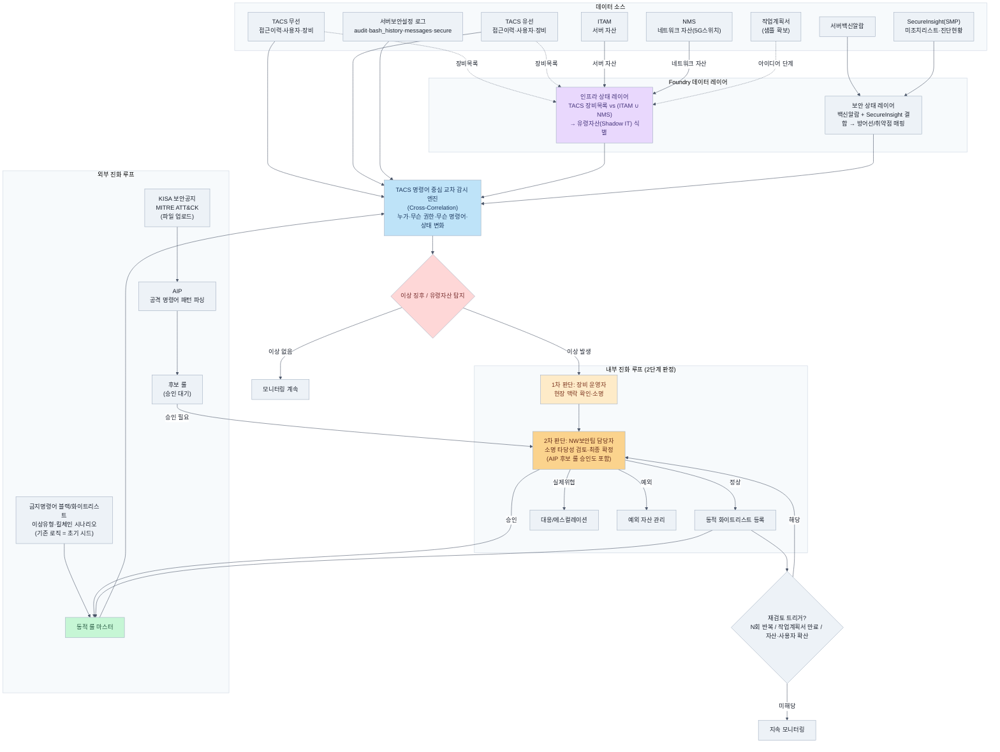

# TACS 명령어 중심 지능형 이상감지 및 규칙 진화 시스템 (보안 사각지대 통제)

## 1. 프로젝트 개요 (Executive Summary)

- **프로젝트명:** TACS 명령어 중심 지능형 이상감지 및 규칙 진화 시스템 (보안 사각지대 통제)
- **대상 조직:** NW보안팀
- **핵심 요약:** 개별 보안 솔루션의 대시보드가 보여주는 '조치완료 또는 백신설치완료 99%'라는 수치적 안도감 뒤에 숨은 **'나머지 1%의 보안 사각지대(유령 자산, EOS대상 예외처리 등)'**를 찾아내고 감시하기 위한 프로젝트입니다. **TACS(접근제어)의 명령어 이력을 중심 축**으로 삼아 인프라 상태와 보안 상태 레이어를 실시간 비교·연동하고, **외부 위협 인텔리전스**와 **내부 관제 피드백 루프**를 통해 스스로 진화하는 KT NW보안팀 맞춤형 보안 플랫폼을 Palantir Foundry 상에 구축합니다.

## 2. 해결하고자 하는 현장의 페인 포인트 (Pain Points)

- **99%의 함정과 1%의 치명타:** 현장에서 설치, 설정되는 보안 솔루션과 정책은 99%로 우수하지만, 장비 노후화, EOS 예정, 미지원 OS 등으로 인해 솔루션을 설치하지 못하고 '예외처리'로 둔 1%가 존재합니다. 공격자는 이 1%의 빈틈을 노리며, 여기서 이상 징후가 나타나면 전체망으로 확산되는 치명적인 문제가 발생합니다.
- **단편적 감시의 한계:** 각 보안 시스템(TACS, 서버백신, SecureInsight 등)이 파편화되어 있어 NW보안팀 담당자가 개별 관리 사이트에 수시로 접속해 확인하기 어렵습니다. 알람 간의 인과관계나 맥락을 파악할 수 없어 오탐 분별 및 선제적 대응이 불가능합니다. 약 0.1%의 문제점을 발견하기 위해 이 작업을 반복하는 것은 유지되기 어려운 업무입니다.
- **정적 룰셋의 한계:** 초기에 ATT&CK이나 특정 명령어 리스트(Blacklist)를 세팅하더라도, 현업의 정상 작업으로 인한 오탐이 발생하여 감시 체계가 무력화되거나 룰 업데이트가 지연됩니다.

## 3. 핵심 아이디어 및 해결 방안 (Core Concept)

### ① 데이터 레이어의 분리 및 결합 (Context Alignment)

각 시스템이 출력하는 상태, 알람, 로그를 파운드리로 집적한 뒤, 성격에 따라 두 개의 레이어로 명확히 분리하여 기준을 잡습니다.

- **인프라 상태 레이어:** 서버 장비는 `ITAM 호스트조회`에, 네트워크 장비는 `NMS`에 각각 등록되므로, 이 둘을 합친 자산 목록을 `TACS 장비 목록`과 비교하여, TACS 상에는 접속·관리 대상으로 존재하지만 ITAM·NMS 어디에도 등록되어 있지 않은 **1%의 유령 자산(Shadow IT)**을 식별합니다. 여기에 `작업계획서`를 연동하여 정상 프로세스 여부를 판단합니다. (작업계획서 연동은 업무 프로세스 개선이 필요하여 아이디어 단계로 설계)
- **보안 상태 레이어:** `서버백신알람`, `SecureInsight 컴플라이언스 진단사항`을 결합하여 각 자산의 방어선 유무와 취약점 노출 상태를 상시 매핑합니다. 현재 설치, 설정 작업이 진행 중인 `EDR`, `서보관설정작업`, `스크립트점검`, `웹셀진단` 등 추가되는 보안작업도 계속 연결하는 계획도 고려합니다.

### ② TACS 명령어 중심의 교차 감시 (Cross-Correlation)

모든 분석은 TACS의 유/무선 접속 이력과 실행 명령어 데이터를 뼈대로 움직입니다. **"누가, 어떤 권한으로, 보안 방어선이 없는 1%의 사각지대 서버에 접속해 무슨 명령어를 내렸고, 그 결과 인프라와 보안 상태가 어떻게 변했는가?"**를 타임라인 기준으로 한눈에 모아서 비교합니다.

- **맥락적 이상 징후 탐지:** TACS에서 `금지 명령어`가 실행되었을 때, 동시간대에 `서버백신알람`이 울렸는지, 혹은 실행 직후 `SecureInsight`에서 미조치 취약점 상태로 변했는지, OS 백업 로그(`secure_bkup` 등)에 비정상 흔적이 남았는지 시스템이 자동으로 대조합니다.

### ③ 시스템의 양방향 자동 진화 메커니즘 (Dual-Loop Integration)

- **외부 진화 루프 (최신 위협 동적 주입):** KISA 보안공지, MITRE ATT&CK 등 공신력 있는 기관의 해킹 사례 및 취약점 피드를 실시간 수집합니다. 파운드리 내 AIP 모듈이 해킹 가이드 원문에서 공격 명령어 패턴을 파싱하여 `동적 룰 마스터`에 실시간으로 업데이트하므로 상시 최신 트렌드 감시가 가능합니다.
- **내부 진화 루프 (소명 기반 오탐 정제):** 이상 감지 발생 시, 아래 4번 항목에서 정의하는 **2단계 판정 구조**를 거쳐 보안팀이 최종 판정 및 사유를 입력하면 파운드리 데이터베이스에 즉시 기록됩니다. 이 데이터가 누적되면 시스템이 자동으로 패턴을 분석하여, 정상 작업계획서가 존재하는 반복적 오탐은 **'동적 화이트리스트'**로 편입시켜 알람을 차단합니다.

## 4. 데이터 처리 방안 (캠프 기간 기준)

연동 방식은 추후 부서간 협의 및 별도 기술 검토가 필요하며, 캠프 기간 동안은 아래 원칙으로 진행합니다.

- **방식:** 실제 운영 데이터를 정기 배치로 export하여 Foundry에 업로드. 실시간 API 연동은 캠프 범위 밖으로 두고, 1차 파일럿은 배치 업로드 방식으로 검증합니다.

## 5. 2단계 판정 구조 (Human-in-the-Loop)

이상 감지부터 최종 반영까지의 흐름을 아래와 같이 구체화합니다.

|단계|담당|역할|
|---|---|---|
|탐지|시스템|TACS 명령어 + 인프라/보안 레이어 교차분석으로 이상 징후 플래그|
|1차 판단|**장비 운영자**|현장 맥락 기준 1차 스크리닝 (본인이 한 작업인지, 알고 있는 작업인지 확인 및 소명)|
|2차 판단|**NW보안팀 담당자**|1차 소명의 타당성 검토 + 최종 [정상/실제위협/예외] 확정|
|반영|시스템|2차 확정 결과만 동적 화이트리스트/룰 마스터에 반영|

**핵심 원칙:** 화이트리스트 편입 권한은 반드시 **2차(보안팀)에게만** 있습니다. 1차 판단만으로 자동 화이트리스트에 등록되면 장비 운영자의 오판이 곧 보안 구멍으로 이어질 수 있기 때문입니다. 이 구조는 6번의 반복 오탐 재검토 로직과도 연결됩니다.

## 6. 반복 오탐 재검토 로직

"정상"으로 확정되어 화이트리스트에 편입된 패턴이라도, 아래 조건 중 하나에 해당하면 자동으로 재검토 큐에 재진입시키는 로직을 둡니다.

- 동일 화이트리스트 항목이 **일정 기간 내 N회 이상** 반복 발생하는 경우
- 화이트리스트 등록 근거였던 **작업계획서의 유효기간이 만료**된 경우
- 동일 패턴이 **다른 자산 또는 다른 사용자**로 확산되는 경우 (원래는 특정 맥락 한정이었던 화이트리스트의 적용 범위가 넓어지는 상황)

이 로직을 통해 "한번 정상 처리되면 영구 방치"되는 상황을 방지합니다. 재검토는 5번 구조와 일관되게 **2차(보안팀)**가 담당합니다.

## 7. 가치 및 기대 효과 (Value Proposition)

- **NW부문 방향성과 일치:** 보안작업도 일일작업검토 수준으로 관리됩니다.
- **완벽한 가시성 (99% ➔ 100%):** 에이전트 내부 로그를 볼 수 없는 사각지대 장비일지라도, TACS 명령어 행위와 주변부(인프라·보안) 데이터를 융합해 100%의 통제력을 확보합니다.
- **현업 친화적 자동화:** 시스템을 사용하면 사용할수록 KT 보안팀의 실제 정비·유지보수 업무 패턴을 시스템이 학습하므로 오탐률이 점진적으로 줄어듭니다.
- **투명한 감사 추적성:** 어떤 사유로 특정 자산을 예외처리했고, 이상 징후 시 어떤 소명(1차 운영자 → 2차 보안팀)을 거쳤는지 전 과정이 데이터 계보에 영구 보관되어 컴플라이언스 및 외부 감사 대응 능력이 극대화됩니다.

---

## 부록 A. 캠프 기간 업로드 가능 데이터 목록

|시스템|파일명|내용|
|---|---|---|
|TACS 무선|기간별 접근이력_6월|접속 session 시간, 입력 명령어, 사용자, 접속 ip, 장비 ip|
|TACS 무선|사용자 목록|사용자, 권한, 회사|
|TACS 무선|장비 목록|장비명, ip|
|TACS 무선|접속 정보 통합_6월|명령어 입력 시간, 사용자, 장비, ip, 입력 명령어 등|
|TACS 유선|기간별 접근이력_6월(유선)|접속 session 시간, 입력 명령어, 사용자, 접속 ip, 장비 ip|
|TACS 유선|사용자 목록(유선)|사용자, 권한, 회사|
|TACS 유선|장비 목록(유선)|장비명, ip|
|TACS 유선|접속 정보 통합_6월(유선)|명령어 입력 시간, 사용자, 장비, ip, 입력 명령어 등|
|서버보안설정|audit.log_bkup|리눅스 용도|
|서버보안설정|bash_history_bkup|리눅스 용도|
|서버보안설정|messages_bkup|리눅스 용도|
|서버보안설정|secure_bkup|리눅스 용도|
|SecureInsight(SMP)|SECUINSIGHT_SMP_THREAT_LIST_1|위험진단 결과 미조치 리스트, 미조치 진단 항목별로 서버는 중복 될 수 있음|
|SecureInsight(SMP)|SECUINSIGHT_SMP 진단 진행사항_1|secureinsight 진행 현황|
|ITAM|호스트조회 20260709|KT 자산 서버 정보, ip, 호스트 정보 현행화 에이전트 실행 이력|
|NMS|NMS_5G스위치|KT 자산 네트워크 설비 스위치 ip|
|금지 명령어 목록|[금지명령어조합]명령어 블랙리스트_화이트리스트 검토결과_최종반영_260710|허용/금지 명령어 셋 정리본|
|이상유형 분류 체계|[이상유형]블랙리스트 그룹유형|블랙리스트 분류유형|
|이상발생 시나리오|[이상시나리오]킬체인 기반 시나리오 탐지 로직.md|시나리오|
|이상발생 시나리오|[이상시나리오]킬체인 기반 시나리오 탐지 로직정리.xlsx|시나리오|
|작업계획서|1. 작업명 노키아 도서지역 Small RM관련 스위치 VLAN|작업계획서 작성 내용|
|보안팀 가이드라인|26년_KT_상시진단용 컴플라이언스|secureinsight 진단항목|
|보안팀 가이드라인|주요정보통신기반시설 기술적 취약점 분석·평가 방법 상세가이드_2026년도|ISMS-P 진단 방법으로 KT 보안팀 업무 가이드 기본이 됨|
|서버백신|서버백신알람|연동형 서버 백신 설치 알람 상태를 알 수 있음|

### 데이터-개념 매핑 메모

- **TACS 무선/유선 (접근이력·사용자·장비·통합):** 3번 ②의 TACS 명령어 중심 교차 감시를 뒷받침하는 핵심 데이터. 유·무선 모두 확보되어 커버리지가 양호함
- **금지 명령어 블랙리스트/화이트리스트 최종반영본:** 3번 ③ "동적 룰 마스터"의 초기 시드 데이터로 바로 활용 가능
- **이상유형 분류체계 + 킬체인 기반 시나리오 탐지 로직:** 이미 현업에 정리된 로직이 존재하므로, AIP가 처음부터 패턴을 새로 파싱하기보다 **이 기존 로직을 룰 엔진의 베이스라인으로 흡수**하는 방향이 현실적
- **서버백신알람 + SecureInsight 미조치 리스트/진단현황:** 3번 ①의 보안 상태 레이어와 매칭
- **서버보안설정 로그(audit.log, bash_history, messages, secure):** TACS 명령어 실행 후 서버단 실제 흔적 대조용 (3번 ② 맥락적 이상 징후 탐지)
- **ITAM 호스트조회 + NMS_5G스위치 + TACS 장비목록:** 3번 ①의 인프라 상태 레이어(유령 자산 식별)에 대응 — 서버는 ITAM, 네트워크는 NMS에 등록되므로 이 둘을 합친 목록을 TACS 장비 목록과 비교. 다만 NMS가 5G 스위치 자산에 한정되어 있어 파일럿 범위가 "네트워크 자산 전체"가 아닌 **5G 스위치 한정**으로 좁혀질 가능성 있음 — 범위 명시 필요
- **작업계획서:** 샘플 1건만 확보되어, 3번 ①에서 언급한 대로 "정상 작업 여부 판단" 자동화는 아직 데이터가 아닌 **아이디어 단계**로 유지하는 것이 타당
- **보안팀 가이드라인(컴플라이언스, ISMS-P 가이드):** 직접적인 탐지 데이터는 아니나, 5번 판정 구조에서 2차(보안팀) 판단의 근거 기준으로 활용 가능

### 아직 확보되지 않은 데이터

- 1차(장비 운영자)/2차(보안팀) 판정 이력 — 워크숍 운영을 통해 신규로 생성되는 데이터이므로 캠프 시작 시점엔 없음
- KISA/ATT&CK 등 외부 위협 인텔리전스 피드 — 3번 ③ 외부 진화 루프는 캠프 기간 중 실데이터 연동 없이 설계 수준으로만 다룸

## 부록 B. 시스템 구성도 (Mermaid)

