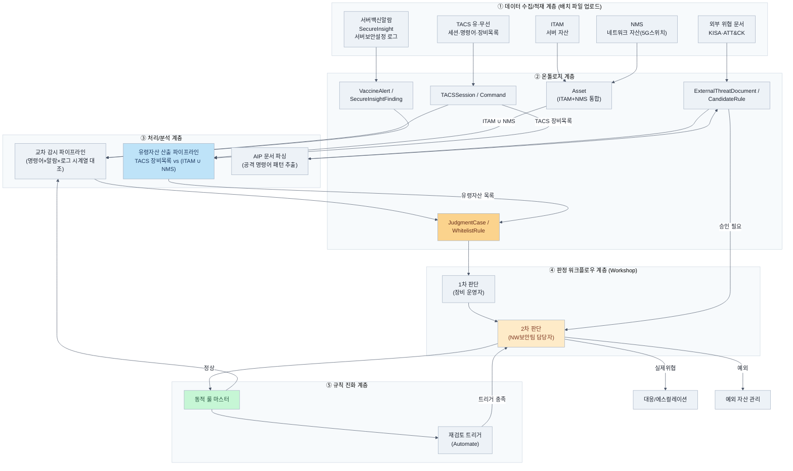

# Architecture: TACS 명령어 중심 지능형 이상감지 및 규칙 진화 시스템

## 0. 문서 정보

|항목|내용|
|---|---|
|문서명|TACS 이상감지 및 규칙 진화 시스템 아키텍처 문서|
|구축 플랫폼|Palantir Foundry|
|문서 범위|**캠프 기간 구현 범위 중심** (Phase 2 확장 고려사항은 8번 참조)|
|관련 문서|프로젝트 브리프, PRD (`TACS_이상감지_시스템_PRD.md`), 사용자 스토리 (`story.md`)|
|버전|v1.1 (Draft)|

---

## 1. 아키텍처 개요

본 시스템은 Palantir Foundry 상에서 아래 5개 계층으로 구성된다.

1. **데이터 수집/적재 계층** — 부록 A 데이터를 배치 파일로 업로드
2. **온톨로지 계층** — 자산, 명령어, 알람, 판정 이력 등 핵심 개체를 모델링
3. **처리/분석 계층** — TACS 명령어를 축으로 인프라·보안 상태를 교차 대조하고, TACS 장비 목록과 ITAM·NMS 자산 목록을 비교하여 이상 징후·유령자산을 산출
4. **판정 워크플로우 계층** — Workshop 기반 1차(장비 운영자)·2차(NW보안팀) 판정 UI
5. **규칙 진화 계층** — 동적 룰 마스터, 재검토 로직(Automate), 외부 위협 문서 기반 룰 확장(AIP)

각 계층은 온톨로지를 중심으로 연결되며, 모든 판정·룰 변경 이력은 Foundry의 데이터 계보(Lineage)에 기록되어 감사 추적성을 확보한다.

**유령자산 식별 로직:** 서버 장비는 ITAM에, 네트워크 장비는 NMS에 각각 등록되므로, 이 둘을 합친 자산 목록을 TACS 장비 목록과 비교하여 TACS 상에는 접속·관리 대상으로 존재하지만 ITAM·NMS 어디에도 등록되어 있지 않은 자산을 유령자산(Shadow IT)으로 식별한다.

## 2. 계층형 아키텍처 다이어그램

## 3. 온톨로지 객체 모델 (초안)

Foundry 온톨로지에 등록할 핵심 객체 타입과 관계를 아래와 같이 초안으로 제시한다. 상세 속성 스키마 및 링크 구성은 구현팀 재량으로 한다.

|객체 타입|설명|주요 속성(예시)|주요 연결 관계|
|---|---|---|---|
|**Asset**|서버(ITAM)·네트워크(NMS) 자산 통합|자산ID, 호스트명, IP, 자산유형(서버/네트워크), 출처(ITAM/NMS)|TACSSession, VaccineAlert, SecureInsightFinding과 연결|
|**TACSSession**|TACS 접속 세션 (유·무선)|세션ID, 사용자, 접속IP, 장비IP, 접속시각|Asset(장비IP 매칭), Command와 연결|
|**Command**|세션 내 실행 명령어|명령어 텍스트, 실행시각, 블랙/화이트리스트 매치여부|TACSSession, WhitelistRule과 연결|
|**VaccineAlert**|서버백신 알람|자산ID, 알람유형, 발생시각|Asset, JudgmentCase와 연결|
|**SecureInsightFinding**|SecureInsight 진단/미조치 항목|자산ID, 진단항목, 조치상태, 진단시각|Asset, JudgmentCase와 연결|
|**JudgmentCase**|이상 징후·유령자산 판정 케이스|케이스ID, 유형(이상명령어/유령자산), 관련Command 또는 관련Asset, 1차소명, 1차판단자, 2차판정, 2차판단자, 판정시각|Command, Asset, WhitelistRule과 연결|
|**WhitelistRule**|동적 화이트리스트/룰 마스터 항목|룰ID, 명령어패턴, 등록근거(JudgmentCase), 등록일, 재검토대상여부|JudgmentCase, Command와 연결|
|**ExternalThreatDocument**|업로드된 외부 위협 문서|문서ID, 출처(KISA/ATT&CK), 업로드일, 원문|CandidateRule과 연결|
|**CandidateRule**|AIP가 문서에서 파싱한 후보 룰|후보ID, 추출 명령어패턴, 출처문서, 승인상태|ExternalThreatDocument, WhitelistRule(승인시)과 연결|

## 4. 데이터 흐름 (Data Flow)

1. **적재:** 부록 A 데이터(TACS 유·무선, 서버백신, SecureInsight, ITAM, NMS, 서버보안로그, 작업계획서 등)를 배치 파일로 Foundry에 업로드
2. **변환/온톨로지 반영:** 파이프라인이 원본 파일을 파싱하여, ITAM(서버)과 NMS(네트워크) 자산을 Asset 객체로 통합하고, TACS 유·무선 데이터를 TACSSession·Command로, 알람·진단 데이터를 VaccineAlert·SecureInsightFinding으로 변환
3. **교차 대조:** 처리 계층이 Command 실행 시각을 기준으로 동일 Asset의 VaccineAlert·SecureInsightFinding·서버보안로그를 시계열로 대조하여 이상 징후 후보를 산출
4. **유령자산 산출:** TACS 장비 목록을 ITAM·NMS 통합 Asset 목록과 비교하여, TACS에는 존재하나 ITAM·NMS 어디에도 등록되어 있지 않은 자산을 유령자산 목록으로 산출
5. **판정 워크플로우:** 이상 징후·유령자산 후보가 JudgmentCase로 생성되고, Workshop을 통해 1차(장비 운영자) 소명 → 2차(NW보안팀 담당자) 최종 판정이 이루어짐
6. **룰 반영:** 2차 판정이 "정상"이면 WhitelistRule로 자동 등록, "실제위협"이면 에스컬레이션, "예외"면 예외 자산으로 관리
7. **외부 위협 룰 확장:** ExternalThreatDocument 업로드 → AIP가 CandidateRule 산출 → 2차 판정자 승인 시에만 WhitelistRule/룰 마스터에 반영
8. **재검토:** Automate가 WhitelistRule을 모니터링하여 재검토 트리거(N회 반복, 작업계획서 만료, 자산/사용자 확산) 충족 시 해당 JudgmentCase를 2차 판정 큐에 재생성
9. **감사 계보:** 위 모든 단계의 변경 이력은 Foundry 데이터 계보에 자동 기록되어 삭제·수정 불가능한 형태로 보존

## 5. 보안 아키텍처

|항목|설계 방향|
|---|---|
|접근 통제|Foundry 프로젝트/네임스페이스 단위로 NW보안팀 내 역할(장비 운영자/보안팀 담당자)에 따라 읽기·쓰기 권한 분리|
|민감정보 비식별처리|계정명, IP 등 원본 데이터의 민감 컬럼은 비식별처리(마스킹) 뷰 또는 컬럼 단위 권한 제어 적용|
|판정 권한 분리|화이트리스트/룰 마스터 반영 권한은 2차 판정(NW보안팀)에게만 부여 — 1차 판정 및 AIP 후보 룰은 반영 권한 없음|
|감사 로그|모든 JudgmentCase, WhitelistRule 변경 이력은 불변(Immutable) 데이터 계보로 보존|

## 6. 캠프 기간 환경 구성

- **연동 방식:** 실시간 API 연동 없이, 부록 A 파일을 정기 배치로 Foundry에 업로드
- **환경:** 캠프 전용 Foundry 프로젝트/워크스페이스 내에서 구성 (운영 환경과 분리)
- **데이터 범위:** 부록 A에 명시된 실제 데이터 전체 + 캠프 기간 중 확보할 KISA/ATT&CK 문서 샘플(오픈이슈 참조)

## 7. Foundry 모듈 활용 매핑

|계층|활용 모듈|
|---|---|
|데이터 수집/적재|데이터 통합/파이프라인 (배치 업로드 및 변환)|
|온톨로지|온톨로지 매니저 (객체/관계 모델링)|
|처리/분석|파이프라인 빌더 (교차 대조, 유령자산 산출 로직)|
|판정 워크플로우|Workshop (1차/2차 판정 UI, 대시보드)|
|규칙 진화|Automate (재검토 트리거), AIP (외부 문서 파싱)|

세부 구현 방식은 FDE 조언을 받아 확정한다.

## 8. Phase 2 확장 시 아키텍처 고려사항

- **실시간 연동 전환:** 배치 업로드 파이프라인을 실시간 스트리밍/API 기반 파이프라인으로 교체 가능하도록, 온톨로지 객체 모델은 배치·실시간 소스 모두 수용 가능한 구조로 설계
- **외부 위협 인텔리전스 자동화:** 현재 수동 업로드 방식의 ExternalThreatDocument 흐름을, 향후 KISA/ATT&CK 피드 자동 수집 파이프라인으로 대체 가능하도록 CandidateRule 승인 워크플로우는 그대로 유지
- **자산 범위 확대:** NMS 5G스위치 한정 구조에서 전체 네트워크 자산으로 Asset 객체 확장 시, 기존 스키마 변경 없이 자산유형 속성만 확장되도록 설계
- **작업계획서 연동:** 현재 샘플 1건 기반 아이디어 단계에서, 향후 작업계획서 시스템과 실제 연동 시 별도 객체(WorkOrder)로 확장하여 JudgmentCase의 1차 판단 근거로 자동 연결

## 9. 오픈 이슈

|#|이슈|비고|
|---|---|---|
|1|온톨로지 객체의 상세 속성/링크 스키마 미확정|구현팀 재량으로 확정 필요|
|2|재검토 트리거 N값, KPI 수치 미확정|PRD 오픈이슈와 동일 (`TACS_이상감지_시스템_PRD.md` 참조)|
|3|AIP 테스트용 KISA/ATT&CK 문서 미확보|PRD 오픈이슈와 동일|
|4|캠프 전용 Foundry 프로젝트/워크스페이스 접근 권한 설정 방식|담당 관리자와 사전 협의 필요|

## 10. 관련 문서

- 프로젝트 브리프: `TACS_이상감지_규칙진화_시스템_브리프.md`
- PRD: `TACS_이상감지_시스템_PRD.md`
- 사용자 스토리: `story.md`
- 시스템 구성도(개념 흐름): `tacs_시스템_구성도.mermaid`