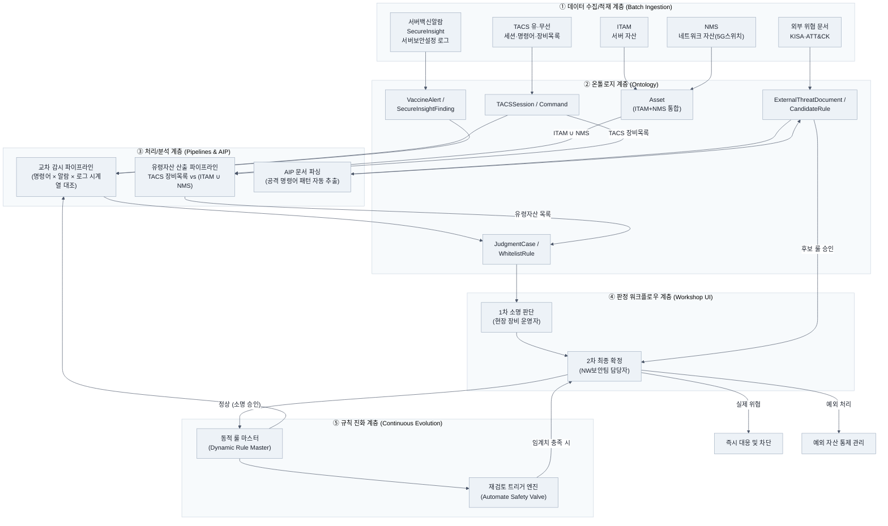

# 🛡️ TACS 명령어 중심 지능형 이상감지 및 규칙 진화 시스템
> **보안 사각지대(1%) 통제를 위한 Palantir Foundry 기반 지능형 보안 운영 플랫폼**  
> *KT NW보안팀 × Palantir Agent Camp*

[](https://www.palantir.com/platforms/foundry/)
[](https://www.palantir.com/platforms/aip/)
[]()
[]()

---

## 📌 1. 프로젝트 개요 (Executive Summary)

개별 보안 솔루션 대시보드가 보고하는 **"백신 설치율 99%", "점검 조치 완료 99%"**라는 숫자는 역설적으로 가장 위험한 사각지대를 가립니다.  
노후화, EOS(End-of-Support), 미지원 OS 등으로 인해 솔루션을 설치하지 못하고 **'예외처리'로 남겨진 나머지 1%의 자산(Shadow IT)**은 공격자의 가장 쉬운 침투 경로가 됩니다.

본 프로젝트는 **TACS(접근제어시스템)의 명령어 이력을 중심 축**으로 삼아, 흩어져 있던 인프라 상태와 보안 상태 레이어를 실시간 교차 대조하고, **외부 위협 인텔리전스(AIP 파싱)**와 **현업 관제 피드백 루프(2단계 Human-in-the-Loop)**를 통해 스스로 진화하는 KT NW보안팀 맞춤형 보안 플랫폼을 **Palantir Foundry** 상에 구축한 결과물입니다.

---

## 🔍 2. 배경 및 현장 페인 포인트 (Pain Points)

```
[기존 한계]
개별 솔루션 파편화 ──> 알람 인과관계 파악 불가 ──> 0.1% 문제 탐색을 위해 반복 작업
       │
99%의 안도감 뒤 1%의 빈틈(유령 자산, 예외 서버) 노출 ──> 공격자 침투 시 전체망 위협
```

| 구분 | 기존 방식의 한계 | 본 플랫폼의 해결책 |
|---|---|---|
| **99%의 함정** | 솔루션 설치 예외 자산, 관리 대장에 없는 미등록 유령 장비 파악 불가 | ITAM·NMS 자산 목록과 TACS 실접속 장비를 비교하여 **유령 자산(Shadow IT) 자동 식별** |
| **단편적 감시** | TACS, 백신, SecureInsight 등 개별 대시보드를 수시로 순회하며 맥락 파악 불가 | TACS 명령어를 축으로 **동시간대 백신 알람·컴플라이언스 미조치 사항을 단일 타임라인 교차 감시** |
| **정적 룰셋의 한계** | 기존 블랙리스트는 정상 작업으로 인한 오탐 누적으로 무력화되거나 업데이트 지연 | 2단계 소명 판정을 통한 **동적 화이트리스트 자동 학습 + Safety Valve 재검토 로직** 적용 |

---

## 🏗️ 3. 시스템 아키텍처 (System Architecture)

본 시스템은 Palantir Foundry 상에서 **5개 핵심 계층**으로 유기적으로 연결됩니다.



---

## 💡 4. 핵심 기능 및 차별점

### ① TACS 명령어 중심의 교차 감시 (Cross-Correlation)
- **맥락적 이상 징후 탐지:** TACS 금지 명령어가 실행되었을 때, 동시간대에 서버 백신 알람이 울렸는지, 직후 SecureInsight 컴플라이언스 미조치 상태로 전이되었는지, OS 감사 로그(`audit.log`, `secure_bkup` 등)에 비정상 흔적이 남았는지 시스템이 자동으로 대조합니다.
- **Shadow IT (유령 자산) 식별:** TACS 상 접속 대상 IP와 ITAM(서버) ∪ NMS(네트워크 스위치) 등록 자산을 실시간 차집합 분석하여 미인가 장비를 자동 분별합니다.

### ② 2단계 판정 구조 (Human-in-the-Loop)
| 단계 | 담당 | 역할 및 권한 |
|---|---|---|
| **1차 판단** | **현장 장비 운영자** | 현장 맥락 기준 스크리닝 (본인 작업 여부 확인 및 작업계획서 기반 소명 등록) |
| **2차 판단** | **NW보안팀 담당자** | 소명 타당성 검토 + 최종 **[정상 / 실제위협 / 예외]** 판정 확정 |
| **룰 반영** | **시스템 (자동)** | **2차(보안팀) 승인 완료 건에 한해서만** 동적 화이트리스트 및 룰 마스터에 자동 편입 |

> **보안 원칙:** 장비 운영자의 1차 판단만으로는 화이트리스트에 자동 등록되지 않으며, 반드시 NW보안팀의 2차 승인을 거치도록 강제하여 통제 구멍을 원천 차단합니다.

### ③ 반복 오탐 안전장치 (Safety Valve 재검토 로직)
화이트리스트에 등록된 패턴이라도 영구 방치되지 않도록 Palantir Automate 기반의 재검토 로직을 가동합니다.
- 동일 화이트리스트 패턴이 **일정 기간 내 N회 이상 반복** 발생 시
- 승인 근거였던 **작업계획서의 유효기간이 만료**된 경우
- 동일 패턴이 **다른 자산 또는 다른 계정**으로 확산되는 경우

### ④ 양방향 진화 루프 (Dual-Loop Evolution)
- **외부 진화 (External Loop):** KISA 보안공지, MITRE ATT&CK 문서를 수동 업로드하면 Foundry AIP가 공격 명령어 패턴을 파싱하여 후보 룰(Candidate Rule)을 자동 생성합니다.
- **내부 진화 (Internal Loop):** 2단계 판정 이력 및 소명 데이터를 누적 학습하여 정상 작업계획서가 존재하는 반복 오탐을 지능적으로 정제합니다.

---

## 📂 5. 프로젝트 문서 목차 (Documentation Directory)

`DOC/` 폴더 내 상세 산출물 목록입니다.

| 파일명 | 문서 내용 및 목적 |
|---|---|
| [01. Brief.md](DOC/01.%20Brief.md) | **프로젝트 브리프:** 프로젝트 개요, 핵심 아이디어, 데이터 수집 명세(부록 A), 시스템 구성도 |
| [01.- 01 파일 목록.md](DOC/01.-%2001%20파일%20목록.md) | **데이터 소스 정의서:** 유·무선 TACS, ITAM, NMS, 백신, SecureInsight 등 연동 파일 상세 명세 |
| [02. PRD.md](DOC/02.%20PRD.md) | **제품 요구사항 정의서(PRD):** 비즈니스 목표, 성공 지표, In/Out Scope, 유스케이스 및 온톨로지 요구사항 |
| [03. Story.md](DOC/03.%20Story.md) | **사용자 스토리:** 장비 운영자, NW보안팀 관리자 관점의 구체적인 페르소나 및 사용자 시나리오 |
| [04. Architecture.md](DOC/04.%20Architecture.md) | **기술 아키텍처 정의서:** 5계층 아키텍처, 온톨로지 스키마, 파이프라인 데이터 흐름, Workshop UI 레이아웃 |
| [05. 발표 작성 개요.md](DOC/05.%20발표%20작성%20개요.md) | **캠프 발표 자료 및 스크립트:** 슬라이드별 핵심 메시지, 발표 구어체 대본, 심사위원 Q&A 방어 논리 |
| [10000. 아이디어 스케치.md](DOC/10000.%20아이디어%20스케치.md) | **초기 아이디어 브레인스토밍 메모:** 사각지대 통제 핵심 콘셉트 발굴 노트 |
| [구성도 mermaid.md](DOC/구성도%20mermaid.md) | **Mermaid 다이어그램 모음:** 시스템 흐름도 및 데이터 관계 시각화 소스 |
| [Session.md](DOC/Session.md) | **Agent Camp 세션 요약:** Day 1 ~ Day 3 주요 이수 커리큘럼 명세 |
| [사이트.md](DOC/사이트.md) | **참조 링크:** 프로젝트 관련 웹 참조 문서 |

---

## 🚀 6. Palantir Agent Camp 여정 및 회고

### 🗓️ Camp Curriculum
- **Day 1: Ontology Orientation & AIP Logic**  
  - TACS, ITAM, NMS, 보안 로그 데이터를 수렴하는 온톨로지 모델링 수립  
  - AIP Analyst와 연계하여 자연어 기반 질의 및 첫 번째 AIP Logic 파이프라인 구현
- **Day 2: Data Health & Observability**  
  - 파이프라인 빌드 및 데이터 헬스 모니터링 체계 구축  
  - 유령 자산 판별 로직 및 시계열 교차 대조 파이프라인 안정화
- **Day 3: Frontend Build (Workshop & OSDK)**  
  - 장비 운영자 소명용 1차 Workshop UI 및 NW보안팀 2차 통합 관제 대시보드 구축  
  - 액션(Action) 기반 승인/반려 및 Automate 재검토 워크플로우 완결

### 💡 "Why Palantir" 돌파 전략 & 바이브 코딩 (Vibe Coding)
- **기존 시도의 한계 극복:** MS Agent(단순 반복 특화), 정적 룰(수만 가지 패턴 유지보수 불가), 단순 LLM 프롬프트(이력 맥락 상실)의 벽을 **팔란티어 온톨로지 기반의 의미론적 연결(Semantic Layer)**로 해결
- **메타프롬프트(Meta-Prompting):** 팔란티어 공식 기술 문서를 선학습시키고, AI FDE에게 구체적인 온톨로지 객체 간 관계와 파이프라인 조건을 지시하는 고도화된 프롬프팅 기법 적용

---

## 👥 7. 프로젝트 정보
- **팀/소속:** KT NW보안팀
- **작성 및 개발:** 이광희 (Palantir Agent Camp)
- **문의:** [Issues](https://github.com/teddy706/Palantir_Agent_camp/issues) 또는 사내 메일
