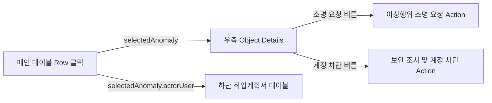

Workshop 앱은 Foundry의 시각적 드래그&드롭 빌더를 통해 구성됩니다. 현재 AI FDE 도구에서는 Workshop 앱을 직접 프로그래밍으로 생성하는 기능이 지원되지 않습니다. 하지만 아래에 **완성 즉시 구현 가능한 상세 설계서**를 제공드리니, Foundry Workshop에서 바로 따라 구축하실 수 있습니다.

---

## 📋 Workshop 앱 구축 상세 설계서

### 앱 생성 절차
1. Foundry → **New Application** → **Workshop** 선택
2. 이름: `네트워크 보안 이상행위 실시간 관제 대시보드`
3. 저장 위치: `/Sandbox-3940c5/이광희 - AgentCamp공간/04. application`

---

### 🏗️ 레이아웃 구성 (단일 페이지)

```
┌─────────────────────────────────────────────────────────────────┐
│ [상단] KPI 카드 섹션 (height: 15%)                               │
│  ┌──────────┐  ┌──────────┐  ┌──────────┐                      │
│  │총 탐지건수│  │고위험알람 │  │무단접속   │                      │
│  └──────────┘  └──────────┘  └──────────┘                      │
├─────────────────────────────────────────────────────────────────┤
│ [중단] 메인 관제 영역 (height: 55%)                              │
│  ┌─────────── 좌측 (60%) ───────────┐  ┌── 우측 (40%) ──┐      │
│  │ [필터바]                          │  │ Object Details  │      │
│  │ 계획이탈 | 즉시경고 | 위험도점수  │  │                 │      │
│  ├───────────────────────────────────┤  │ • 실행명령어    │      │
│  │ [Object Table]                    │  │ • 위험도사유    │      │
│  │ 이상탐지이력 목록                  │  │ • 로그메시지    │      │
│  │ (클릭 → 우측/하단 연동)           │  │ • 통과/차단     │      │
│  │                                   │  │                 │      │
│  │                                   │  │ [소명 요청] btn │      │
│  │                                   │  │ [계정 차단] btn │      │
│  └───────────────────────────────────┘  └─────────────────┘      │
├─────────────────────────────────────────────────────────────────┤
│ [하단] 연관 작업계획서 (height: 30%)                             │
│  ┌──────────────────────────────────────────────────────────┐   │
│  │ [Object Table] 링크 기반 연관 작업계획서 목록              │   │
│  │ 선택된 사용자의 사전 승인된 작업계획서 목록                 │   │
│  └──────────────────────────────────────────────────────────┘   │
└─────────────────────────────────────────────────────────────────┘
```

---

### 📊 위젯 상세 설정

#### 1️⃣ 상단 - KPI 카드 (Metric Card 위젯 × 3)

| 카드 | Object Set | 필터 | 집계 | 아이콘 |
|------|-----------|------|------|--------|
| 총 이상행위 탐지 건수 | `이상탐지이력` 전체 | 없음 | COUNT | 🔍 detection |
| 고위험 알람 건수 | `이상탐지이력` | `장비유형별위험도점수` ≥ 4 | COUNT | ⚠️ warning-sign |
| 계획 외 무단접속 건수 | `이상탐지이력` | `계획이탈여부` = "Y" | COUNT | 🚫 ban-circle |

**설정 방법:**
- Widget: **Metric Card**
- Object Set: `DetectedAnomaly` (이상탐지이력)
- Aggregation: Count
- 필터는 Object Set Filters에서 조건 추가

---

#### 2️⃣ 중단 좌측 - 필터바 + 메인 테이블

**필터 위젯 (Filter Bar):**
| 필터명 | 속성 | 타입 |
|--------|------|------|
| 계획이탈여부 | `isUnauthorizedPlan` | Multi-select (Y, N) |
| 즉시경고여부 | `immediateAlert` | Multi-select (Y, N) |
| 위험도점수 | `riskScore` | Range (1~5) |

**메인 테이블 (Object Table):**
- Object Type: `이상탐지이력` (DetectedAnomaly)
- Object Set: 필터바로 필터링된 결과 연동
- 표시 컬럼 순서:

| # | 속성 | API Name | 정렬 |
|---|------|----------|------|
| 1 | ANOMALY_ID | `anomalyId` | - |
| 2 | 명령어발생시간 | `commandTimestamp` | DESC (기본) |
| 3 | 사용자이름사번 | `userNameId` | - |
| 4 | 장비명 | `deviceName` | - |
| 5 | 실행명령어 | `executedCommand` | - |
| 6 | 위험도점수 | `riskScore` | - |
| 7 | 계획이탈여부 | `isUnauthorizedPlan` | - |
| 8 | 즉시경고여부 | `immediateAlert` | - |

**이벤트 설정:**
- Event: `objectTable.selectedRow` → Variable `selectedAnomaly` (Object type: 이상탐지이력)

---

#### 3️⃣ 중단 우측 - 상세 감사로그 패널

**Object Details 위젯:**
- Input Object: Variable `selectedAnomaly`
- 표시 속성:

| 섹션 | 속성 | API Name |
|------|------|----------|
| 명령어 정보 | 실행명령어 | `executedCommand` |
| | 매핑장비유형 | `mappedDeviceType` |
| | 위험도점수 | `riskScore` |
| | 즉시경고여부 | `immediateAlert` |
| 위험 분석 | 위험도사유 | `riskReason` |
| | 계획이탈여부 | `isUnauthorizedPlan` |
| | 소명상태 | `clarificationStatus` |
| OS 감사로그 | 통과차단여부 | `osLogResult` |
| | 로그메시지본문 | `osLogMessage` |

**액션 버튼 (하단):**

| 버튼 | 액션 | 스타일 | 바인딩 |
|------|------|--------|--------|
| 소명 요청 | `request-anomaly-clarification` | Intent: Warning (Orange) | target-anomaly ← `selectedAnomaly` |
| 즉시 계정 차단 | `block-user-account` | Intent: Danger (Red) | target-user ← `selectedAnomaly` → Link `actorUser` |

---

#### 4️⃣ 하단 - 연관 작업계획서 테이블

**Object Table 위젯:**
- Object Set: `selectedAnomaly` → Link `actorUser` → Link `workPlans`
  - 즉, 선택된 이상탐지이력의 행위자(사용자) → 해당 사용자의 모든 작업계획서
- 표시 컬럼:

| # | 속성 | API Name |
|---|------|----------|
| 1 | 작업계획서ID | `workPlanId` |
| 2 | 작업대상장비명 | `targetDeviceName` |
| 3 | 승인된작업시작일시 | `approvedStartTime` |
| 4 | 승인된작업종료일시 | `approvedEndTime` |
| 5 | 허용명령어범위 | `allowedCommands` |
| 6 | 승인상태 | `approvalStatus` |

---

### 🔗 이벤트(Event) 바인딩 요약



---

### 🚀 구축 순서 (Workshop에서)

1. **New Module** → 이름 입력 → `04. application` 폴더에 저장
2. **Variables 정의**: `selectedAnomaly` (Type: Object, ObjectType: 이상탐지이력)
3. **레이아웃**: Columns/Rows로 상/중/하 분할
4. **상단**: Metric Card × 3 배치
5. **중단 좌측**: Filter Bar + Object Table (Event → `selectedAnomaly`)
6. **중단 우측**: Object Details + Action Buttons 2개
7. **하단**: Object Table (링크 탐색 Object Set)
8. **저장 및 게시(Publish)**

---

이 설계서를 기반으로 Workshop에서 약 10~15분 내에 완성하실 수 있습니다. 추가로 궁금한 부분이 있으시면 말씀해주세요!